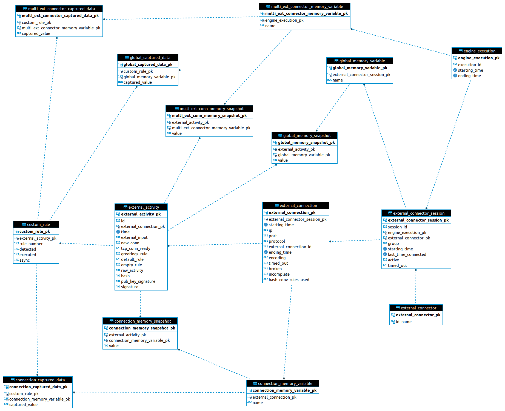

.. index:: Alerting

.. _activities:

Activity Alerting & Storage
===========================
In this chapter we are going to talk about the result of the interactions: activities (a.k.a. external activities). They are the result of the rules execution, or any relevant event of 
the interaction life cycle of the interactions. These activities are created in the **external connector** and sent to the **engine** for being saved, or being sent as alerts to other systems. 

The integrity of the activities has been considered in the design of *Lope*, since the **engine** also signs them cryptographically to ensure their integrity. This makes especially sense 
when you are using encryption between **external connectors** and the **engine**, because the encryption mechanism is `ChaCha20-Poly1305 <https://en.wikipedia.org/wiki/ChaCha20-Poly1305>`_. 
This algorithm is considered an `authenticated encryption <https://en.wikipedia.org/wiki/Authenticated_encryption>`_ which simultaneously provides the confidentiality and authenticity of 
data in motion. The combination of both assure that any generated activity is genuine, and the integrity is preserved from its creation to the reporting.

The activity signature is done using `Elliptic Curve Digital Signature Algorithm (ECDSA) <https://en.wikipedia.org/wiki/Elliptic_Curve_Digital_Signature_Algorithm>`_, especially the 
curve which implements NIST P-256 (FIPS 186-3, section D.2.3).

.. index:: Activities Reporting

Activities Reporting
--------------------
There are plenty of options in the reporting aspect of the activities. in :ref:`architecture` you can see the different reporting channels available to send alerts, and below in this section 
of the documentation you will find how to configure that integration. You can customize even how the reporting is done, in general you just tell report all activites for all enabled options
doing this:

.. code-block:: 

   # -----------------------------------------------------------
   # Operational parameters of the interation 
   # and connection with third parties
   # -----------------------------------------------------------
   operation:

      # GENERAL ASPECTS
      # ===============
      ...

      # TO ENABLE TLS/DTLS USE
      # ======================
      ...

      # SOCKET CONNECTION CLOSE
      # =======================
      ...

      # ACTIVITY REPORTING
      # ==================

      # Report the acitivities for all reporting channels enabled 
      alert_all_flag: yes # yes/no(default)

      # OTHER TOPICS
      # ============
      # Additional aspects should be defined here, but 
      # they will be described in the respective sections
      # of this documentation, for the sake of clarity
      ...

Or you can decide for which activity what reporting mechanism you want to use. You can do this by adding the ``alert`` field in the corresponding rule. If you enable the case
for using all available channels (globally in the ``operation`` section, or in each rule), this disable the selection of specific reporting channels.

.. index:: Basic Rules Reporting
.. rubric:: Basic Rules Reporting

For any basic rule you can do the following:

.. code-block:: 

   any_basic_rule:
      # What to send to the third parties 
      # when the rule is executed
      # If empty or not present, 
      # the rule is considered 
      # 'executed' without sending 
      # anything to the third party
      value: [message to be sent] 

      # If the content of the field 'value' 
      # is encoded in base64
      b64_flag: no # yes/no(default)

      # If the rule is enabled and 
      # can be used for the interaction
      enable: yes # yes/no(default)

      # Alerting fields
      alert:
         # all channels, default option
         all: no # yes/no(default)

         email: yes # yes/no(default)

         http: no # yes/no(default)

         kafka: no # yes/no(default)

         syslog: yes # yes/no(default)

For ``timeout`` and ``ending`` the basic rules, *Lope* will report their corresponding events, not the rule execution.

.. index:: Custom Rules Reporting
.. rubric:: Custom Rules Reporting

For custom rules, the configuration is the same:

.. code-block:: 

   any_custom_rule:

      # GENERAL FIELDS
      # ==============
      ...

      # SOCKET CLOSE SCENARIOS
      # ======================
      ...

      # ALERTING FIELDS
      # ===============
      alert:
         # all channels, default option
         all: no # yes/no(default)

         email: yes # yes/no(default)

         http: no # yes/no(default)

         kafka: no # yes/no(default)

         syslog: yes # yes/no(default)

      # OTHER FIELDS
      # ============
      ...
      

.. index:: Memory Reporting

Memory Reporting
----------------
You can report snapshots of the memory variables in every activity as well. This will produce a large amount of data, so please take that in mind.
This feature could be relevant for debugging purposes, but it is not recommended for real operation scenarios. To enable this, you can do it using 
the following fields in the engine configuration file:

.. code-block:: 

   # -----------------------------------------------------------
   # Operational parameters of the interation 
   # and connection with third parties
   # -----------------------------------------------------------
   operation:

      # GENERAL ASPECTS
      # ===============
      ...

      # TO ENABLE TLS/DTLS USE
      # ======================
      ...

      # SOCKET CONNECTION CLOSE
      # =======================
      ...

      # ACTIVITY REPORTING
      # ==================

      # Report the acitivities for all reporting channels enabled 
      alert_all_flag: yes

      # Report the status of the memory for each external activity generated 
      # (This adds many entries in the database)
      report_memory: yes # yes/no(default). 

      # Encode b64 the memroy variables content at the time of reporting memory
      encode_b64_memory_reported: yes # yes/no(default). 

      # OTHER TOPICS
      # ============
      # Additional aspects should be defined here, but 
      # they will be described in the respective sections
      # of this documentation, for the sake of clarity
      ...

.. index:: Activities Storage

Activities Storage
------------------
*Lope* comes with a database schema ready to be imported into `MariaDB <https://mariadb.org/>`_ or `MySQL <https://www.mysql.com/>`_, ready to save any activity or any captured data for any interaction.
Below you can find the `Entity Relationship (ER) Diagram <https://www.visual-paradigm.com/guide/data-modeling/what-is-entity-relationship-diagram/>`_ that allow to save all the data. 
In this diagram, an ``external_connector_session`` is any session that the **external connector** establishes with the **engine**. The ``external_connection`` is any session (or interaction) that the
**external connector** establishes with a third party. As you will see, in any activity you can save the status of the memory variables in use as we have already explained.

Additionally, *Lope* provides simple file storage capabilities to create a file where all activities will be saved during the execution. The use of the database or the file case are independent,
in the sense of using one does not affect the another. In order to configure the different persistence capabilities, you have to add the following in the engine configuration file (explained previously
in :ref:`engine_configuration`):

.. code-block:: 

  data_service:

      # Max number of data workers for the data service
      # to save information in parallel. 
      # If '0' or negative values, then the default 
      # value is used ('200')
      max_number_data_workers: 200 

      # To just save the information in a simple file
      simple_file_storage:

         enable: no # yes/no(default)

         # not include the final '/', do not use '.'.
         # For using the current folder, use only this ""
         folder_path: "/raw_data"
         is_relative_path: yes

         # To encode in b64 the activities to be saved
         encode_b64: no #yes/no(default). 

      # Database use
      database:
         # mariadb / mysql: https://github.com/go-sql-driver/mysql
         # is the database enable for this execution?
         enable_sql_db: yes

         # Database credentials
         user: root
         password: toor

         # Database data
         ip: "127.0.0.1" # or url
         port: 3306
         schema: "slv_engine"

         # --------------
         # TLS
         # --------------
         # in case the connection with the database is encrypted using TLS
         tls_config:
            # is the connection with the database encrypted?
            enable: no

            ca_cert: ""
            # If a CA o custom CA is in use, 
            # they are not self-signed certs (InsecureSkipVerify option)
            skip_certificate_verification: no
            relative_path_for_certificates: yes

            # For client TLS authentication (Lope => MariaDB/MySQL)
            engine_client_cert: ""
            engine_client_key: ""

            # in case the private key of the certificate is protected 
            # using a password
            engine_client_key_protected: yes
            engine_client_key_protected_password: ""

Activities Alerting
-------------------
To configure the integration with the respective alerting channels, you have to configure the ``alerting`` section of the engine configuration file,
and the number of workers to parallelize the delivery of alerts. Then, you have to add the configuration channels you want to use.

.. code-block:: 

  alert_service:

   # Max number of data workers for the data service
   # to save information in parallel. 
   # If '0' or negative values, then the default 
   # value is used ('200')
   max_number_alert_workers: 200 

   # Alerting channel configuration 
   # (for those in use)
   syslog: ...

   kafka: ...

   email: ...

   http: ...

.. index:: Syslog Alerting
.. rubric:: Syslog Alerting

.. code-block:: 

  alert_service:

   # Max number of data workers for the data service
   # to save information in parallel. 
   # If '0' or negative values, then the default 
   # value is used ('200')
   max_number_alert_workers: 200 

   # Alerting channel configuration 
   # (for those in use)
   syslog: 
      enable: no # yes/no(dafult)

      remote_flag: no # yes/no(dafult)

      # One of the following: tcp/udp(default)
      remote_syslog_protocol: "tcp" 

      remote_syslog_server_ip: "localhost" # or domains

      remote_syslog_server_port: 515

      tag: "lope"

      # send the activities encoded base64?
      encode_activity_base64: yes # yes/no(default)

      # --------------
      # TLS
      # --------------
      # in case the connection with the database is encrypted using TLS
      tls_config:
         # is the connection with the database encrypted?
         enable: no

         ca_cert: ""
         # If a CA o custom CA is in use, 
         # they are not self-signed certs (InsecureSkipVerify option)
         skip_certificate_verification: no
         relative_path_for_certificates: yes

         # For client TLS authentication (Lope => Syslog)
         engine_client_cert: ""
         engine_client_key: ""

         # in case the private key of the certificate is protected 
         # using a password
         engine_client_key_protected: yes
         engine_client_key_protected_password: ""

   # Other alerting channels
   ...

.. index:: Kafka Alerting
.. rubric:: Kafka Alerting

.. code-block:: 

  alert_service:

   # Max number of data workers for the data service
   # to save information in parallel. 
   # If '0' or negative values, then the default 
   # value is used ('200')
   max_number_alert_workers: 200 

   # Alerting channel configuration 
   # (for those in use)
   syslog: 
      enable: no # yes/no(dafult)

      server_ip: 127.0.0.1 # Or domain

      server_port: 8888

      topic: "lope"

      create_topic_if_not_exist: yes # yes/no(default)

      # Distribution or balancer, it must be one of the following: 
      # 'LEAST_BYTES'(default),'CRC32BALANCER','MURMUR2BALANCER', 'HASH'
      distribution: "LEAST_BYTES" 

      # One of the following: 'PLAIN','SCRAM' or 'NONE'(default)
      authentication_mechanism: "NONE" 

      # Only in use for scam authentication, one of the following: 'SHA256' or 'SHA512'(default)
      auth_scram_hash: "SHA512" 

      # topic partition
      event_key: "lope" 

      timeout: 10 # seconds

      user: ""

      password: ""

      # send the activities encoded base64?
      encode_activity_base64: yes # yes/no(default)

      # --------------
      # TLS
      # --------------
      # in case the connection with the database is encrypted using TLS
      tls_config:
         # is the connection with the database encrypted?
         enable: no

         ca_cert: ""
         # If a CA o custom CA is in use, 
         # they are not self-signed certs (InsecureSkipVerify option)
         skip_certificate_verification: no
         relative_path_for_certificates: yes

         # For client TLS authentication (Lope => Kafka)
         engine_client_cert: ""
         engine_client_key: ""

         # in case the private key of the certificate is protected 
         # using a password
         engine_client_key_protected: yes
         engine_client_key_protected_password: ""

   # Other alerting channels
   ...

.. index:: Email Alerting
.. rubric:: Email Alerting

.. code-block:: 

  alert_service:

   # Max number of data workers for the data service
   # to save information in parallel. 
   # If '0' or negative values, then the default 
   # value is used ('200')
   max_number_alert_workers: 200 

   # Alerting channel configuration 
   # (for those in use)
   syslog: 
      enable: no # yes/no(dafult)

      smtp_ip: "smtp.gmail.com" # or domains

      smtp_port: 587

      # One of the following: 'PLAIN'(default),'CRAMMD5'
      authentication_mechanism: PLAIN
      
      # SMTP
      # https://pkg.go.dev/net/smtp
      smtp_plain_auth_identity: ""

      smtp_auth_user: "seclopedevega@gmail.com"

      smtp_auth_password: ""

      smtp_plain_auth_host: "smtp.gmail.com"

      # email fields
      from: "seclopedevega@gmail.com"

      # lists of email addresses for different fields
      reply_to:
         - "seclopedevega@gmail.com"

      to:
         - ""

      cc:
         - ""

      bcc:
         - ""

      subject: "[SecLopeDeVega][Activity Report]"

      # The activity is added after the body intro and before the body end
      body_intro: 
         "
         <h2> Hello there, it's Lope</h2>\n
         ---------------------------------\n
         ACTIVITY = "

      body_end: 
         "
         \n\n---------------------------------\n
         "

      # send the activities encoded base64?
      encode_activity_base64: yes # yes/no(default)

      # --------------
      # TLS
      # --------------
      # in case the connection with the database is encrypted using TLS
      tls_config:
         # is the connection with the database encrypted?
         enable: no

         ca_cert: ""
         # If a CA o custom CA is in use, 
         # they are not self-signed certs (InsecureSkipVerify option)
         skip_certificate_verification: no
         relative_path_for_certificates: yes

         # For client TLS authentication (Lope => SMTP)
         engine_client_cert: ""
         engine_client_key: ""

         # in case the private key of the certificate is protected 
         # using a password
         engine_client_key_protected: yes
         engine_client_key_protected_password: ""

   # Other alerting channels
   ...

.. index:: HTTP Alerting or Webhook
.. rubric:: HTTP Alerting or Webhook

.. code-block:: 

  alert_service:

   # Max number of data workers for the data service
   # to save information in parallel. 
   # If '0' or negative values, then the default 
   # value is used ('200')
   max_number_alert_workers: 200 

   # Alerting channel configuration 
   # (for those in use)
   syslog: 
      enable: no # yes/no(dafult)

      url: "http://127.0.0.1"

      # One of the following: 'POST'(default),'PUT' or 'GET'
      method: GET 

      timeout: 10 # seconds

      # HTTP Headers
      headers:
         # header_key: header_value
         aaa: "aaaa"
         bbb: "bbb"

      # Query string parameters. If the activity must be sent via parameters, 
      # use '{{ACTIVITY}}' in the parameter value
      url_parameters: 
         # parameter_key: parameter_value
         aaa: "aaaa"
         bbb: "bbb"

      # This parameter allows to send the activity in the HTTP body, 
      # it is recommended to disable it for HTTP GET method
      use_body_flag: yes # yes/no(default). 

      # The activity is added after the body intro and before the body end
      body_intro: 
         "
         Hello there, it's Lope</h2>\n
         ---------------------------------\n
         ACTIVITY = "

      body_end: 
         "
         \n\n---------------------------------\n
         "

      # send the activities encoded base64?
      encode_activity_base64: yes # yes/no(default)

      # --------------
      # TLS
      # --------------
      # in case the connection with the database is encrypted using TLS
      tls_config:
         # is the connection with the database encrypted?
         enable: no

         ca_cert: ""
         # If a CA o custom CA is in use, 
         # they are not self-signed certs (InsecureSkipVerify option)
         skip_certificate_verification: no
         relative_path_for_certificates: yes

         # For client TLS authentication (Lope => HTTP Server/Service)
         engine_client_cert: ""
         engine_client_key: ""

         # in case the private key of the certificate is protected 
         # using a password
         engine_client_key_protected: yes
         engine_client_key_protected_password: ""

   # Other alerting channels
   ...
