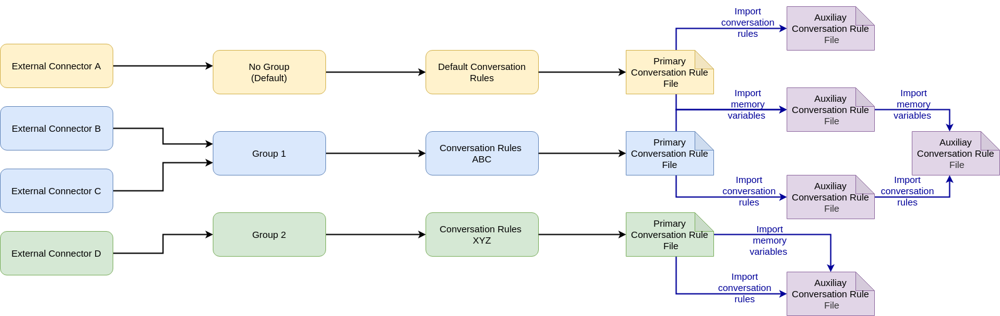

.. index:: Advance Conversation Rules

.. _advance_conversation_rules:

Advance Conversation Rules
==========================
In this chapter, we are going to see more advance options that are available for the use of the conversation rules to provide more tools
for defining more complete scenarios, or just easy the use of *Lope* to operators. 

.. index:: Conditional External Connector Execution

Conditional External Connector Execution
----------------------------------------
This feature allows the **external connector** to wait for certain conditions before starting to interact with third parties. This feature needs the use of multi external 
connector memory varibales, because the **external connector** starts its execution but it does not interact directly with third parties. It will wait until some conditions
are satisfied (memory variables in Redis have the right values), before starting any interaction. We can say that the **external connector** is 'sleeping' until the right
time to 'wake up'. 

In order to use this functionality, you have to configure it in the ``operation`` section of the conversation rules. It can get the IP and port for the execution from some 
memory variables as well, so as to start the execution using dynamic data. The memory variables used for the conditions can be different for those declared to be used in the 
interaction, therefore you do not need to declare them as you do for those you are going to use. In the following example you can see how this can be configured.

.. code-block:: 

  # -----------------------------------------------------------
  # Operational parameters of the interation 
  # and connection with third parties
  # -----------------------------------------------------------
  operation:

    # GENERAL ASPECTS
    # ===============
    ...

    # TO ENABLE TLS/DTLS USE
    # ======================
    ...

    # SOCKET CONNECTION CLOSE
    # =======================
    ...

    # SESSION SUPPORT
    # ===============
    ...

    # CONDITIONAL EXT CONN EXECUTION
    # ==============================
    conditional_execution:
        # use conditional execution in this execution?
        enable: no # yes/no(default)

        # list of conditions: memory values and the value
        conditions:
            # One condition
            - var_name: order_66
                value: True

            # Another condition
            - var_name: order_67
                value: False

        # If present, the ip value will be 
        # gathered from this memory variable
        mem_var_ip: var1 
        
        # If present, the port value will be 
        # gathered from this memory variable
        mem_var_port: var2

    # OTHER TOPICS
    # ============
    # Additional aspects should be defined here, but 
    # they will be described in the respective sections
    # of this documentation, for the sake of clarity
    ...

.. index:: Async Switch

Async Switch
------------
We have already seen that one custom rule can trigger several async or hybrid custom rules as well. However, the 'OR' is missing, this means that
you may trigger this set of custom rules asynchronously, or this another set of them; depending on some conditions (memory variables and their values).
This provides flexibility to interact differently depending on the execution context, so alternative interactions now can take place. 

In order to configure that, you can follow the below example. Any 'case' of the 'switch' has to define the list of ``conditions`` that make it applicable, 
and the list of ``rules`` to trigger asynchronously when that happens. The 'switch' structure is made up of ``options`` (cases) and the ``dafault`` (when 
no option is applicable). However, the ``default`` one is optional.

.. code-block:: 

  any_custom_rule:

    # GENERAL FIELDS
    # ==============
    ...

    # ASYNC SWITCH 
    # ============
    # Switch for executing some async (or hybrid) rules depending 
    # on conditions. E.g., ff memory variable 'AAAA' has the value 
    # 'X' (value field), or it has the same content of the memory 
    # variable 'BBB', then execute the async Rule 'N'. In case no 
    # option fits, use the async rule of the default field (if present, 
    # and the list length is greater than 0)
    async_switch:

        options:
            # first option or 'case' wit a list of conditions to satisfy
            - conditions:
                # list of conditions
                - var_name: var1
                    value: 2
                    reference_variable: var2

                # if conditions are satisfied, then a set of async 
                # (or hybrid) rules to execute
              rules:
                - rule_id: 3
                  delay: 3

            # second option or 'case'
            - conditions:
                - var_name: var1
                    value: 2
                    reference_variable: var2
              rules:
                - rule_id: 3
                  delay: 3

        # other cases:
        #   Another case
        #   - conditions:...
        #     rules:...
        #
        #   and another one
        #   - conditions:...
        #     rules:...

        default:
        # set of async ruls to execute if no 'case' statement
        # is applicable
        - rule_id: 3
            delay: 3

    # OTHER FIELDS
    # ============
    # Other fields expalined in this documentation
    ...

.. index:: Async Loop

Async Loop
----------
The async loop is another interesting feature to model interactions and provide more flexibility. This feature allows you execute a set of rules asynchronously
while some conditions are satisfied. Every time the rules are going to be executed, the loop conditions are reviewed for checking if a new iteration should take places.
This means that iterations will may take place in different times, according to the different delays of the rules. Howevever, every rule will have its loop. Not all the 
rules of the loop are executed in every iteration, only the rule that is going to be executed. Therefore, we can say that we have several parallel virtual loops in place
with the memory same conditions.

.. code-block:: 

  any_custom_rule:

    # GENERAL FIELDS
    # ==============
    ...

    # ASYNC LOOP 
    # ==========
    # Switch for executing some async (or hybrid) rules depending 
    # on conditions. E.g., ff memory variable 'AAAA' has the value 
    # 'X' (value field), or it has the same content of the memory 
    # variable 'BBB', then execute the async Rule 'N'. In case no 
    # option fits, use the async rule of the default field (if present, 
    # and the list length is greater than 0)
    async_loop:

      # list of the conditions of the loop
      # they can use another memory variable 
      # or a fixed value. In case of both are 
      # present, the memory variable will be used
      conditions:
        - var_name: var1
          value: 2
          # OR
          reference_variable: var2

      # list of rules to execute
      rules:
        # this rule will be executed every 3 seconds, 5 times 
        # as maximum
        - rule_id: 3
          delay: 3
          # if present and grater than 0, this means the number
          # of times the iteration can take place per each rule
          max_number_iterations: 5 

        # this rule will be executed every 5 seconds
        - rule_id: 17
          delay: 5
      

    # OTHER FIELDS
    # ============
    # Other fields expalined in this documentation
    ...

.. index:: External Connector Fork

External Connector Fork
-----------------------
If having an **external connector** (or some of them) is great, why not inviting more to the party?!. This is exactly what this feature does:
It allows you to create new **external connectors** during the interaction.

.. code-block:: 

  any_custom_rule:

    # GENERAL FIELDS
    # ==============
    ...

    # EXT CONN FORK 
    # =============
    # You can create new instances of external connectors 
    # if a rule is executed and optionally, passing a 
    # new configuration file, external connector id and 
    # password (secret). If these parameters are not provided, 
    # the new instance of external connector will start as
    # as the original did (this is powered by python subprocess module)
    fork:
      # is this feature enable?
      enable: yes

      # Optional parameters. 
      # -------------------
      # If they are not provided, the paremeters of the current 
      # external connector will be used

      # config file to use for the new external connector
      config_file: "/path/to/a/different/config/file"

      # ID to use for the new external connector
      new_id: "Terminator"

      # password to use for the new external connector
      new_secret: "sshhhhhh...it's_a_secret"

      # number of instances to create
      number: 3 # Number of instances to create
      

    # OTHER FIELDS
    # ============
    # Other fields expalined in this documentation
    ...

.. index:: Conversation Rules Groups

Conversation Rules Groups
-------------------------
As you may have already realised, for complex interaction scenarios you will need a lot of rules. This could be a performance issue when you have a new input, 
despite of having a parallel analysis of the potential RegEx. In order to overcome that issue, the rule groups comes into play: they group rules in blocks,
and that block is only applicable under some conditions (It could be a RegEx, or some values for some memory variables). In any case, the rules of the group
are not evaluated (or disabled) until the group applicable.

This measure can really help in the reduction of the number of RegEx evaluations, apart of providing a bit of order in the conversation rule file. 
Just for your information, groups are evaluated **after** the evaluation of the non-grouped *conversation rules*. Below you can find how you can implement 
that feature in the conversation rule file:

.. code-block:: 

    # -----------------------------------------------------------
    # Conversation Rules
    # -----------------------------------------------------------
    conversation:

        greetings:... # Basic Rule

        default:... # Basic Rule

        empty:... # Basic Rule

        timeout:... # Basic Rule

        ending:... # Basic Rule

        custom_rules: # Set of custom rules

            
            # GROUPED RULES
            # ------------
            groups: 
            # list of groups

              # One group that is enabled using regex
            - id: group_A
              # The regex that makes this group applicable
              regex: [any regex]

              # list of custom rules
              rules: ...

              # Another group is enabled using memory variables
            - id: group_B

              # List of memory conditions that make the group applicable
              memory_conditions: 
                  # var1 == fixed_value?
                - var_name: var1
                  value: [any fixed_value]

                  # var2 == var3?
                - var_name: var2
                  reference_variable: var3

              # list of custom rules
              rules: ...

            # NON-GROUPED RULES
            # -----------------
            rules: ... # list of custom rules that do not
                       # belong to any group

.. index:: Multiple Conversation Rules Files

Multiple Conversation Rules Files
---------------------------------
We have seen that there are plenty of possibilities about what you can do with the rules and the memory variables. However, having everything in one file
could be a madness to work with that. The proposed solution is to split the conversation rules file into a primary one, and a set of auxiliary ones that will be imported
at the time of loading the primary conversation rules file. 

This also allows that you can have some things defined in specific files and imported into several different conversation rules files. The things that you can put in this
secondary kind of files are custom conversation rules, and memory variables declaration. The auxiliary files can import other auxiliary files as well, providing more flexibility
at the time of creating smaller piece of conversarion rules in different files.

In order to this, you have to do the following in the primary conversation rule file:

.. code-block:: 

    # ====================================================
    # EXAMPLE PROTOCOL
    # Author: Alberto Dominguez
    # ====================================================
    # this is just a field just for 'operators', it is not relevant for operation
    name: example 

    # Which external connector group is assigned for this rules.
    #  If empty, or 'default' ==> no group (only one file valid without group)
    ext_conn_group: B 

    # This enables the use of this conversation rules. 
    # This means that you can have some conversation rules files
    # that are in the folder, but they are deactivated and then, 
    # they will no be sent to any external connector.
    enable_use: no # yes/no (default). 

    # -----------------------------------------------------------
    # Operational parameters of the interation 
    # and connection with third parties
    # -----------------------------------------------------------
    operation: ... # to be explained later

    # -----------------------------------------------------------
    # Execution memory
    # -----------------------------------------------------------
    memory_variables: 
    
      # some memory variables defined (if any)
      # ... 
      multi_extconn_level:...

      global_level:...

      connection_level:...

      # list of files to import
      import:

        # ALWAYS IMPORT .YML FILES!
      - path: /path/to/auxiliary/file/for/more/memory/variables.yml
        is_relative: yes

    # -----------------------------------------------------------
    # Conversation Rules
    # -----------------------------------------------------------
    conversation: 

      greetings:... # Basic Rule

      default:... # Basic Rule

      empty:... # Basic Rule

      timeout:... # Basic Rule

      ending:... # Basic Rule

      custom_rules:

        rules:...

        groups:...

        # list of files to import
        import:

            # ALWAYS IMPORT .YML FILES!
          - path: /path/to/auxiliary/file/for/more/custom/rules.yml
            is_relative: yes

And, in any auxiliary conversation rule file, you can add the following information:

.. code-block:: 

    # ====================================================
    # AUXILIARY CONVERSATION RULE FILE
    # Author: Alberto Dominguez
    # ====================================================
    # this is just a field just for 'operators', 
    # it is not relevant for operation
    name: additional file x32 

    # Fields used at the time of importing memory variables
    # -----------------------------------------------------
    multi_extconn_level:...

    global_level:...

    connection_level:...

    # Fields used at the time of importing conversation rules
    # -------------------------------------------------------
    rules:...

    groups:...

    # Fields used to import additional auxiliary files
    # ------------------------------------------------
    # list of files to import
    import:

        # ALWAYS IMPORT .YML FILES!
      - path: /path/to/another/auxilary/file.yml
        is_relative: yes

The auxiliary files can have any of those fields, bnut they are not mandatory. It could happen that one file has one
one field of them, or you have rules and memory variables in the same file, but this file should be used in the memory 
and in the rules sections to really import the whole content. 

The following image expand the previous used image of how 
the **external connectors** are linked with the *conversation rules*, adding some different imported files to the existing 
example.

