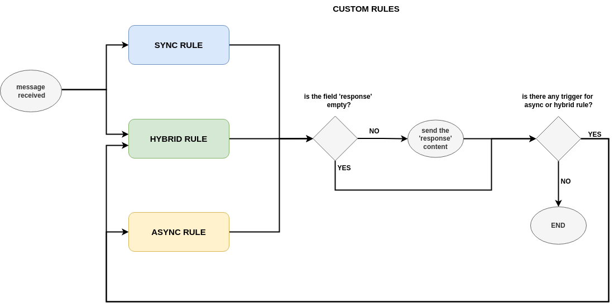

.. index:: Conversation Rules
    
.. _conversation_rules:

Conversation Rules
==================
The *conversation rules* are the rules that control how the interaction between the **external connectors** and the external parties. This allows
to use the same software to interact differently according to some configuration files. These rules have been slight introduced in the :ref:`intro` and 
how the **external connectors** are assigned to different *conversation rules* is already explained in :ref:`engine_configuration`. In this section,
we are going to explain more the basics of the *conversation rules*.

.. index:: Conversation Rules File

Conversation Rules File
-----------------------
As described in :ref:`engine_configuration`, the folder that contains the *conversation rules* files have to be defined in the **engine** configuration file. 
The *conversation rules* files are `yml <https://en.wikipedia.org/wiki/YAML>`_ files as it is the **engine** configuration file. The basic structure of these files
is as follows: 

.. code-block:: 

    # ====================================================
    # EXAMPLE PROTOCOL
    # Author: Alberto Dominguez
    # ====================================================
    # this is just a field just for 'operators', it is not relevant for operation
    name: example 

    # Which external connector group is assigned for this rules.
    #  If empty, or 'default' ==> no group (only one file valid without group)
    ext_conn_group: B 

    # This enables the use of this conversation rules. 
    # This means that you can have some conversation rules files
    # that are in the folder, but they are deactivated and then, 
    # they will no be sent to any external connector.
    enable_use: no # yes/no (default). 

    # -----------------------------------------------------------
    # Operational parameters of the interation 
    # and connection with third parties
    # -----------------------------------------------------------
    operation: ... # to be explained later

    # -----------------------------------------------------------
    # Execution memory
    # -----------------------------------------------------------
    memory_variables: ... # to be explained in 
                          # 'Memory Variables & Operations'

    # -----------------------------------------------------------
    # Conversation Rules
    # -----------------------------------------------------------
    conversation: ... # to be explained later

.. index:: Operation Section of Conversation Rules Files
.. rubric:: Operation Section of Conversation Rules Files

The operation field presented previously has many subfields. The first of them are general one, the following two
is for enabling the use of TLS or DTLS (provided that the configuration is already addressed in the configuration 
of the corresponmding **external connector**); and finally some fields for the capability of closing/reconnecting 
the socket connection but not the logical connection.

This allows to interact in some cases where the interaction happens not only one single **tcp** connection, and the 
socket connection is closed and renewed several times. For instance, the interaction with an HTTP API. *Lope* is able 
to work in two ways: 

* Closing the socket connection every time it answers to an input, considering the answering not only the execution of a 
  syncrhonous rule, it is also all the asyncrhonous tasks that are triggered as result.

* Closing the socket connection only in those cases where it is declared in a specific rule.

As previously said, the **external connector** keep the 'logical' connection open, until it reachs the end or it is timed out.
You can consider the socket connection as part of the 'logical' connection entity in that regard.

.. code-block:: 

    # -----------------------------------------------------------
    # Operational parameters of the interation 
    # and connection with third parties
    # -----------------------------------------------------------
    operation:

        # GENERAL ASPECTS
        # ===============
        mode: server # server(default)/client

        # In server mode: Origin IP from external connections, 
        # empty means any.
        # In client mode: what ip to connect (o domain)
        ip: "" 

        # TCP(default)/UDP
        transport_protocol: TCP 

        # IPv6 support
        use_ip6: no # yes/no(default)

        # Network port to use
        port: 1883

        # A value of the following list: 
        # 'utf-8' (default), 'utf-16', 'utf-32', 'ascii'
        encoding: utf-8 

        # Recommendation: Disable this if the tcp 
        # connection will be closed after answering
        use_port_for_connection_identification: no # yes/no(default). 

        # Max time to consider that a connection with a 
        # third party should be timed out. 
        # 0 (or negatives values) means no timeout for connections
        interaction_timeout: 300 # seconds, 

        # number of unaccepted connections that the 
        # system will allow before refusing new connections 
        # Recommendation: use same value than number of 
        # concurrent connections or larger
        connection_queue: 5 # (default = 5)

        # Max number of bytes accepted as input 
        max_input_size: 1024 # default = 1024

        # Max number of concurrent connections allowed, 
        # in client mode it will be the number of connections
        # established with the target
        max_concurrent_connection: 5 # (default = 5)

        # Time before starting the execution once the external 
        # connector has everything ready to run
        execution_delay: 3 # seconds 

        # This means that only the first rule detected if 
        # several conversation rules are applicable.
        # The rule with the smallest ID is the one executed.
        # This changes the way of how the external connector
        # checks the regex of custom rules. Instead of being parallel,
        # now it is sequential to ensure that only the first hit 
        # is used.
        conversation_use_only_first_hit: no # yes/no(default) 

        # TO ENABLE TLS/DTLS USE
        # ======================
        # The external connector TLS configuration should be
        # already in place before enabling the use of encryption
        # for the interaction.

        # This enables TLS or DTLS
        encrypted: no # yes/no (default). 

        # This enable TLS authentication
        tls_client_authentication: no # yes/no (default). 

        # SOCKET CONNECTION CLOSE
        # =======================
        # It is only aplicable for tcp, tls or dtls.

        # It closes the socket connection every time after answering / replying
        # It disables the functionality 'enable_rule_triggered_closing_socket_connection'. 
        close_socket_connection_after_replying: no # yes/no(default) 
        
        # it closes the socket but it not ends the logical 
        # conection when the mode of close after answering 
        # is not enable and a rule with the 'closing' field is enable
        enable_rule_triggered_closing_socket_connection: yes # yes/no(default) 

    
        # OTHER TOPICS
        # ============
        # Additional aspects should be defined here, but 
        # they will be described in the respective sections
        # of this documentation, for the sake of clarity
        ...

        
.. index:: Conversation Section of Conversation Rules Files
.. rubric:: Conversation Section of Conversation Rules Files

This section contains the rules that steer the interaction. As described in the :ref:`intro`, there are three different of *conversation rules*:
the basic one and the custom ones. The last category means that they are defined by the operator (the user) of *Lope*. As described in the :ref:`intro`, 
they can be syncrhonous, asyncrhonous or hybrid rules.

In this section of the file, the basic rules listed ready to be configured as well the corresponding subsection for defining the custom rules.

.. code-block:: 

    # -----------------------------------------------------------
    # Conversation Rules
    # -----------------------------------------------------------
    conversation:

        greetings:... # Basic Rule

        default:... # Basic Rule

        empty:... # Basic Rule

        timeout:... # Basic Rule

        ending:... # Basic Rule

        custom_rules:... # Set of Custom Rules

.. index:: Basic Rules

Basic Rules
-----------
The basic rules are rules that are executed in specific events in the lifecyecle of the interaction. 
All the basic rules are the same in terms of configuration, they have the same fields:

.. code-block:: 

    any_basic_rule:
        # What to send to the third parties 
        # when the rule is executed
        # If empty or not present, 
        # the rule is considered 
        # 'executed' without sending 
        # anything to the third party
        value: [message to be sent] 

        # If the content of the field 'value' 
        # is encoded in base64
        b64_flag: no # yes/no(default)

        # If the rule is enabled and 
        # can be used for the interaction
        enable: yes # yes/no(default)

        # Other fields related to alerting
        # that will be expalined in 
        # 'Activity Alerting & Storage' 
        ...

The basic rules are executeded in specifc times, understanding 'executed' as sending the content of the field 'value' to the third party.

* ``greetings``: The first message sent to the external party in the moment the interaction (session) is established for the first time.

* ``default``: This rule is executed if a message is received from an external party, and there is not any custom rule that is applicable.

* ``empty``: This rule is executed if a message is received from an external party, but it is an empty message.

* ``timeout``: This rule is executed if the interaction (session) is timed out.

* ``ending``: This rule is executed if the interaction (session) is ended.

The following diagram represents how the different rules are executed:

.. index:: Custom Rules

Custom Rules
------------
The custom rules are those that are defined by the operator (user) of *Lope*. They are defined in the ``custom_rules`` field of the ``conversation`` field.
They can be grouped and this is explained in :ref:`advance_conversation_rules`, so here we only will explain the basics about the custom rules.

.. code-block:: 

    # -----------------------------------------------------------
    # Conversation Rules
    # -----------------------------------------------------------
    conversation:

        greetings:... # Basic Rule

        default:... # Basic Rule

        empty:... # Basic Rule

        timeout:... # Basic Rule

        ending:... # Basic Rule

        custom_rules: # Set of custom rules

            # GROUPED RULES
            # ------------
            groups: ... # To be explained in the 
                        # 'Advance Conversation Rules' Section

            # NON-GROUPED RULES
            # -----------------
            rules: ... # list of custom rules that do not
                       # belong to any group

The custom rules have the following common structure, regardless the kind of rules they are:

.. code-block:: 

    any_custom_rule:

        # GENERAL FIELDS
        # ==============
        # An id number. It is not autogenerated, 
        # it should be added manually, 
        # and it should be unique
        id: 101

        # The kind of rule, one of the following:
        # sync, async or hybrid 
        mode: sync

        # What to send to the third parties 
        # when the rule is executed.
        # If empty or not present, 
        # the rule is considered 
        # 'executed' without sending 
        # anything to the third party
        response: [message to be sent] 

        # If the content of the field 'response' 
        # is encoded in base64
        response_b64: no # yes/no(default)

        # If the rule is enabled and 
        # can be used for the interaction
        enable: yes # yes/no(default)

        # SOCKET CLOSE SCENARIOS
        # ======================
        # For TCP & DTLS connections (and server mode), 
        # it closes the socket but it not ends the logical 
        # connection (interaction) when the mode of close 
        # after answering is not enable. 
        # The field' enable_rule_triggered_closing_socket_connection'
        # should be enable to use this field
        # (in the 'operation' section)
        closing_connection: no # yes/no (default) 

        # Only aplicable for tcp transport protocol 
        # or DTLS & client mode. It reconnects the 
        # socket before execute the rule.The field 
        # 'enable_rule_triggered_closing_socket_connection'
        # should be enable to use this field 
        # (in the 'operation' section)
        reconnect_before_rule_execution: no # yes/no(default) 

        # OTHER FIELDS
        # ============

        # this field triggers the interaction ending
        ending_rule: no # yes/no (default)

        # Other fields expalined in this documentation
        ...

Note that not all fields should be present in all the rules, only when you need you should add it. 
The mandatory fields are: ``id``, and ``mode``.

In order to understand how the different custom *conversation rules* can work together, the following diagram represents
how the complete process work of replying to any message received from third parties.

.. index:: The Interaction Flow and Conversation Rules
.. rubric:: The Interaction Flow and Conversation Rules

Once that we have seen the basic *conversation rules*, and the custom *conversation rules*; we can combine both diagrams in one to see
the interaction as a process flow of *conversation rules*. In this diagram, the concepts of if there is something to reply or not, the 
socket closing (and reconnection), and the option to enable or disable basic rules are also included as well.

.. index:: Synchronous Rules

Synchronous Rules
-----------------
The custom syncrhonous rules are those that are applicable when their RegEx is applicable for a given input. It could happen that
several of them are applicable, and they rest of them or only the first one will executed depeneding on the field ``conversation_use_only_first_hit``
of the ``operation`` section.

.. code-block:: 

    any_custom_sync_rule:

        # GENERAL FIELDS
        # ==============
        ...
        mode: sync

        # SYNC FIELDS
        # ============
        # RegEx that make the rule applicable 
        regex: [any regex]

        # Just in case the 'regex' field is 
        # encoded in base 64
        regex_b64: no # yes/no (default)

        # OTHER FIELDS
        # ============
        # Other fields expalined in this documentation
        ...

.. index:: Asynchronous and Hybrid Rules

Asynchronous and Hybrid Rules
-----------------------------
These rules are those that can be executed without any input, they are triggered by other rules. 
This happens because the triggering (custom) rule has the field ``trigger`` where you list all of the 
async or hybrid rules that should be triggered, as well as if it should wait a certain period of time
before being executed.

However, some async rules can be triggered from the beginning, and they have specific fields to be marked
as an async rule to be called from the start of the interaction: ``beginning_async_rule`` and ``beginning_async_delay``.

The following example is the fields for a triggering rule, and async rule only needs to have the ``mode`` field as ``async``.

.. rubric:: Async Rules

.. code-block:: 

    any_triggering_rule:

        # GENERAL FIELDS
        # ==============
        ...

        # ASYNC TRIGGERING FIELDS
        # =======================
        trigger:

              # One Async rule to execute
            - rule_id: 3 # Async ID rule to execute
              # Time to wait until executing the rule 
              # descibed in the 'rule trigger' field
              delay: 30 # seconds 

              # Another async rule to execute, 
              # In this case, without delay
            - rule_id: 5 

        # OTHER FIELDS
        # ============
        # Other fields expalined in this documentation
        ...

And this is an example of an async rule to be executed from the beginning of the interaction:

.. code-block:: 

    any_async_rule:

        # GENERAL FIELDS
        # ==============
        ...
        mode: async

        # ASYNC FIELDS FOR BEGINNING ASYNC RULES
        # =====================================
        # mark this rules as an async rule to execute 
        # from the beginning of the interaction
        beginning_async_rule: yes # yes/no (default)

        # time to wait from the beginning of the interaction 
        # until the rule is executed
        beginning_async_delay: 30 # seconds 
        
        # OTHER FIELDS
        # ============
        # Other fields expalined in this documentation
        ...

.. rubric:: Hybrid Rules

This rules are Synchronous and asyncrhonous at the same time, they can be triggered by a regular expression,
or being triggered by another rule.

.. code-block:: 

    any_custom_hybrid_rule:

        # GENERAL FIELDS
        # ==============
        ...
        mode: hybrid

        # SYNC FIELDS
        # ============
        # RegEx that make the rule applicable 
        regex: [any regex]

        # Just in case the 'regex' field is 
        # encoded in base 64
        regex_b64: no # yes/no (default)

        # OTHER FIELDS
        # ============
        # Other fields expalined in this documentation
        ...

.. rubric:: Async or Hybrid Rules as Set of Steps

You can see, sometimes  you 'execute' a rule, but it does not reply anything to the third party. You may think this is usless, 
but you will see that this case makes sense once you have other capabilities that will be explained in other chapters of this 
documentation (e.g.: calling or executing memory operations). Then, they work as a kind of 'steps' for these actions, 
especially when several of them are triggered one after the another in a kind of 'steps' list or chain.

.. index:: Session Suport

