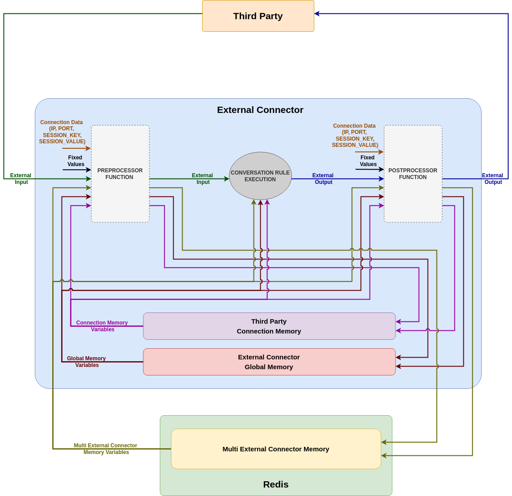
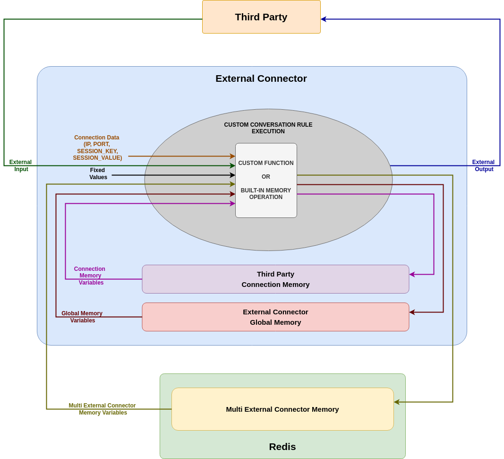

.. index:: Custom Functions

.. _custom_functions:

Custom Functions
================
One of the best features that *Lope* provides is to allow that you can add your own Python code to expand the current capabilities already provided.
This has already mentioned in the :ref:`external_connector_configuration`, in the ``operation`` section of the **external connector** configuration
file. You need to provide the location and name of the Python module where *Lope* can find your own code, as explained in the preiously cited chapter.
If the custom function module can not be imported, the execution of the **external connector** can take place but the interactions will not use those

You can add your own code in three different ways in the interaction:

* **Pre-processor function**: If it is used, this function is called every time a new message is received from a third party before any action of *Lope*.
  This can be interesting in interactions that you need something before executing the *Lope* actions. For instance, if your interaction is using a binary 
  protocol, you should convert the binary into text based information before using *Lope*.

* **Post-processor function**: If it is used, this function is called every time after *Lope* has something to send to third party as part of the process of 
  replying them. This covers the need of doing something at the end of the response process. In the precious example, this can allow you to convert into binary 
  the text *Lope* have already prepared.

* **Function in Custom Rule**: Any custom rule can execute a function in the same way that it can execute a built-in memory operation, as explained in 
  :ref:`memory_operations`.

In any case, the functions called has to be called using the exact name, and you should provide the same number and in the same order of parameters as they are defined. 
In case of not, those not provided parameters will be autoprovided using an empty string, a '0' or 'false', depending on the case. For the number of memory variablesfor 
saving the output of a function is not the same of the results the function provides, then some values will be lost. In case of providing more memory variables than 
results, they will remain unchanged.

Please, keep in mind that the *pre-processor* and *post-processor* will always use the 'external input' or 'external output' (depending on the preprocessor function used) 
as the first input and output of those functions. Therefore, you only can add additional inputs and outputs to the pre/post-processor functions. This is one of the the main 
differences with the normal custom functions (those called in any custom rule execution), the pre/post-processor functions have the mandatory input and output that is the 
'external input' for the *pre-processoror* function, and the 'external output' for the *post-processor* function. The rest of potential inputs and outputs are optional, 
and can be any memory variable or fixed (hardcoded) values, or even some connection data (**ip**, **port**, the **session key** or **session value**). For the functions 
called from any custom rule, all the values are optional and even they can have none.

The following image represents how the  *pre-processor* and *post-processor* functions work in the response process. Please keep in mind that you can use only one of those functions 
if needed, you do not need to use both always.

The next one represents the potential inputs of custom functions called in custom rules, or any built-in memory operations, since both work in the same way. They can use the same
potential inputs and outputs, you only have to choose what you need. 

As you can see in the image, there is another big difference between pre/post-processor functions and these other operations: the use of the 'external output'. *Post-processor* function 
can use it, but these functions or memory operations they cannot: they only modify the memory variables. Depending on the configuration of when the custom functions in rules should be executed
('rule detection' vs 'rule execution'), you can use the modified memory variable in the response. In case you execute the custom functions after the rule execution, the potential reply is already sent.
Nevertheless, this is not an issue because if you need to do an operation and then replying to the third party, you can call the function or memory operation in the sync custom rule, 
and trigger an async rule to send the reply right after the sync rule. Following that idea, you can concatenate several memory operations (built-in or custom functions) as a set of async or 
hybrid rules (as we have already seen at the end of the :ref:`conversation_rules`).

.. index:: Custom Pre-processor Function

Custom Pre-processor Function
-----------------------------
Once we have seen the concepts behind the use of custom functions, it is time to see how to use them. To use the *pre-processor* function, you have to add the following information in the 
``operation``:

.. code-block:: 

  # -----------------------------------------------------------
  # Operational parameters of the interation 
  # and connection with third parties
  # -----------------------------------------------------------
  operation:

      # GENERAL ASPECTS
      # ===============
      ...

      # TO ENABLE TLS/DTLS USE
      # ======================
      ...

      # SOCKET CONNECTION CLOSE
      # =======================
      ...

      # SESSION SUPPORT
      # ===============
      ...

      # CUSTOM FUNCTIONS
      # ================
      custom_function_preprocessor:

        # name of the function to call
        name: testing_preprocessor
        
        # the external input will always be the first
        # input, others are defined here:

        # additional
        input:
          - var1
          - var2
          - 2
          - 'IP'
        # In this case the input of the function is:
        # ('external input', var1, var2, 2, ip value) => testing_preprocessor

        # the external input will always be the first
        # output, others are defined here:

        # additional
        output:
          - var1
          - var2
        # In this case the output of the function is:
        # testing_preprocessor => ('external input', var1, var2)

      # OTHER TOPICS
      # ============
      # Additional aspects should be defined here, but 
      # they will be described in the respective sections
      # of this documentation, for the sake of clarity
      ...

.. index:: Custom Post-processor Function

Custom Post-processor Function
------------------------------
The use of the custom *post-processor* is almost identical to the *pre-processor* function:

.. code-block:: 

  # -----------------------------------------------------------
  # Operational parameters of the interation 
  # and connection with third parties
  # -----------------------------------------------------------
  operation:

      # GENERAL ASPECTS
      # ===============
      ...

      # TO ENABLE TLS/DTLS USE
      # ======================
      ...

      # SOCKET CONNECTION CLOSE
      # =======================
      ...

      # SESSION SUPPORT
      # ===============
      ...
      
      # CUSTOM FUNCTIONS
      # ================
      custom_function_postprocessor:

        # name of the function to call
        name: testing_postprocessor
        
        # the external output will always be the first
        # input, others are defined here:

        # additional
        input:
          - var1
          - var2
          - 'hello!'
        # In this case the input of the function is:
        # ('external output', var1, var2, 'hello!') => testing_postprocessor

        # the external input will always be the first
        # output, others are defined here:

        # additional
        output:
          - var1
          - var2
        # In this case the output of the function is:
        # testing_postprocessor => ('external output', var1, var2)

      # OTHER TOPICS
      # ============
      # Additional aspects should be defined here, but 
      # they will be described in the respective sections
      # of this documentation, for the sake of clarity
      ...

.. index:: Custom Functions in Custom Rules

Custom Functions in Custom Rules
--------------------------------
In contrast of the pre/post-processor functions, the functions in custom rules are defined in the rules that execute them, in the same way of the built-in memory operations.
In case of a custom rule contains a built-in memory operation and a custom function, then the built-in memory operation will be executed first and later, the custom function call.

The use of the same reserver words that we have seen in :ref:`memory_operations` is also applicable here:

* ``EXT_IN``: the external input from the third party

* ``IP``: the ip of the connection

* ``PORT``: the port of the connection

* ``SESSION_KEY``: the session key of the connection

* ``SESSION_VALUE``: the session value of the connection

The execution of custom function can be adjusted to decide 'when' takes place, as we have already seen for :ref:`memory_operations`: in the 'rule detection' step (when the rule is 
considered as applicable), or in the 'rule execution' step (when the rule is executed and the response is sent). This is configured in in the ``operation`` section as follows:

.. code-block:: 

  # -----------------------------------------------------------
  # Operational parameters of the interation 
  # and connection with third parties
  # -----------------------------------------------------------
  operation:

    # GENERAL ASPECTS
    # ===============
    ...

    # TO ENABLE TLS/DTLS USE
    # ======================
    ...

    # SOCKET CONNECTION CLOSE
    # =======================
    ...

    # SESSION SUPPORT
    # ===============
    ...

    # CUSTOM FUNCTIONS
    # ================
    # One of the following: "rule_detected", "rule_executed"(default)
    custom_functions_when: rule_detected 

    # OTHER TOPICS
    # ============
    # Additional aspects should be defined here, but 
    # they will be described in the respective sections
    # of this documentation, for the sake of clarity
    ...

and the way to declare the use of the custom function within a rule can be found here:

.. code-block:: 

  any_custom_rule:

    # GENERAL FIELDS
    # ==============
    ...

    # CUSTOM FUNCTION 
    # ===============
    custom_function:

      # custom function enable for this rule?
      enable: yes # yes/no(default)

      name: function_name

      # List of inputs
      input:
        - EXT_IN # 'external input'
        - var1
        - 3.14

      # List of memory variables
      # to save the results
      output:
        - var3
        - var4

    # In this example:
    # ----------------
    # Inputs to the custom function
    # ('external input', var1, 3.14) => function_name

    # Output of the custom function
    # function_name => (var3, var4)

    # OTHER FIELDS
    # ============
    # Other fields expalined in this documentation
    ...