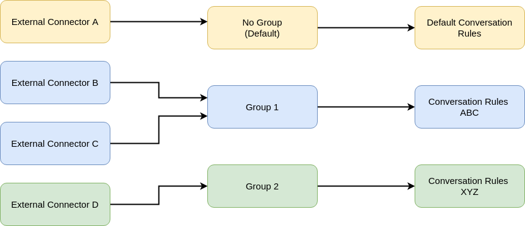

.. index:: Engine Configuration

.. _engine_configuration:

Engine Configuration
====================

The main configuration file of the **engine** is the *engine_config.yml* file, but the name can be changed if the configuration file is passed 
as command line option (As explained in :ref:`engine_installation`). However, the file should be always a `yml <https://en.wikipedia.org/wiki/YAML>`_ file. 
In this file, you configure everything related the **engine** execution, but nothing about the **external connectors** neither *conversation rules* 
(except in which  folder they are located).

External Connectors Connection
------------------------------
.. index:: ZeroMQ & Encryption
.. rubric:: ZeroMQ & Encryption

Starting from the basics, the first thing you need to configure is the ZeroMQ communication for the **external connectors**. 
You should tell if you wish to encrypt the connection with the already encryption functionality. Depending on what you do, there are two results:

* If you enable it, the connection between the **engine** and the **external connectors** will encrypted using `RSA <https://en.wikipedia.org/wiki/RSA_(cryptosystem)>`_ 
  as asymmetric algorithm to exchange the session key, and the symmetric algorithm will be `ChaCha20-Poly1305 <https://en.wikipedia.org/wiki/ChaCha20-Poly1305>`_. 
  *Lope* has mutual authentication for every exchange of messages, the **engine** authenticates to the **external connectors** in this context via a cryptographic signature using 
  `RSA-PSS <https://en.wikipedia.org/wiki/Probabilistic_signature_scheme>`_ and `SHA-512 <https://es.wikipedia.org/wiki/SHA-2>`_. So, the ``engine_auth_code`` is 
  transformed first into a SHA 512 digest, and then, signed using RSA-PSS. This is sent to the external conenctors every time to prove they are talking with the 
  expected engine (and they know this because this ``engine_auth_code`` is in their configuration file as well). The **external connectors** authenticate against the angine
  by providing their passwords as hashes using `BLAKE2b <https://en.wikipedia.org/wiki/BLAKE_(hash_function)>`_. Since the messages are encrypted, the hash is always shared encrypted.

* If you do not enable it, then the communication is not encrypted but still there is a mutual authentication in place for the **external connectors** and the **engine**. 
  The ``engine_auth_code`` then is transformed using `BLAKE2b <https://en.wikipedia.org/wiki/BLAKE_(hash_function)>`_ and this is sent to the **external connectors**. 
  In this scenario, they authenticate using BLAKE2b. 
  
.. note::

  Keep in mind that in the second scneario (not enable the ``engine_auth_code`` field), the content of the messages are visible by third parties, including the authentication hashes.

Below, you can find the part of the configuration file for the networking part:

.. code-block:: 

   networking:
      # 0MQ Server
      mq:
         port: 5555
         ipv6 : no # use ipv6? yes/no (default)

         # For the connections between external connectors 
         # and the engine
         engine_auth_code: no # yes/no(default) 

         # Minimum possible value is 2048
         rsa_key_lengt: 4096 # default value

         # for the hash code sent to external connectors 
         # to ensure they are talking with right engine
         engine_auth_code: "Y0_s0y_0zym4nd14s_r3y_d3_r3y3s!"

.. index:: External Connectors Groups & Conversation Rules
.. rubric:: External Connectors Groups & Conversation Rules

One the ZeroMQ connection is configured, then the next step is to configure the **external connectors** groups and what *conversation rules* to use. In order to deliver *conversation rules*
to the **external connectors**, we need to introduce the concept of groups. All **external connectors** belong to one group. If it is not explicitly defined, then the default group is used.
In the picture below you can find a grahical description of this idea.

Therefore, you can assign different *conversation rules* to different **external connectors**, according to the groups they belong. This is configured in the configuration file as follows:

.. code-block:: 

  # configuration about the external connectors, 
  # depending on the group they belong.
  # if they belong to some specific group, 
  # the corresponding conversation rules are loaded
  # The group is described in the conversation rules file
  external_connectors:
    # not include the final '/', do not use '.'. 
    # For using the current folder, use only this ""
    conv_rules_folder:
      path: "/conv_rules"
      is_relative_path: yes

    # configuration about the number of external connectors 
    # and external conenctor workers (threads)
    max_number_of_workers: 200 # pool size
    max_number_of_external_connectors_connected: 15

    # This is the password for those external connectors that 
    # do not belong to any group, they will use the
    # 'default conversation rules' 
    default_secret: "3sT0_3S_s3Cr3t0!"

    groups:
      # one example group
      - id: "test_client"
        list:
          - id: "ExtConTest_Client"
            secret: "3sT0_3S_s3Cr3t01!"

      # other example group
      - id: "test_server"
        list:
          - id: "ExtConTest_Server"
            secret: "3sT0_3S_s3Cr3t02!"

      # other example group
      - id: "test_neo2"
        list:
          - id: "ExtConTest4"
            secret: "3sT0_3S_s3Cr3t03!"

      # other example group
      - id: "B"
        list:
          - id: "ExtConX"
            secret: "3sT0_3S_s3Cr3t04!"

          - id: "ExtConY"
            secret: "3sT0_3S_s3Cr3t05!"

As you can see, you configure the list of groups, with their respective **external connectors** members with their passwords. 
You also configure the default password for those external connectors that do not belong to any group and they can autogenerated IDs.
Additionally, you can configure where are the *conversation rules* files, the max number of **external connectors** connected at the same time,
as well as the max number of external connector worker threads to use.

.. index:: Engine Logging

Engine Logging
--------------

Other important part to configure is the logging of the **engine**. It leverage the capabilities of `zerolog library <https://github.com/rs/zerolog>`_, and there are different possibilities for logging:

* **Console logging:** The logs are only showed via the terminal, and they can be *human friendly* if the ``console_human_friendly`` is enabled (this is applicable in any option that use the console).

* **File logging:** The logs are saved in `JSON <https://es.wikipedia.org/wiki/JSON>`_ format

* **Console & file logging:** Logs are saved in a file, as well as shown via console.

* **File logging with log rotation:** In this case, the logs are `rotated <https://en.wikipedia.org/wiki/Log_rotation>`_ in several files depending on the configuration parameters.

* **Console & file with log rotation:** Logs are saved in several files as described in the previous point, as well as shown via console.

The created log files have the following name structure: ``slv_engine_%Y-%m-%d-%H:%M:%S.log`` (example: ``2022-August-25_7:3:39.log``). But the prefix and file extension can be changed 
in the configuration file. If the specified log folder does not exist, it will be created.

.. code-block:: 

  logging:
    # log level, one of the following: TRACE, DEBUG, INFO (default), 
    # WARN, ERROR
    level: "DEBUG"

    # log mode: CONSOLE (default), FILE, BOTH, FILE_ROTATING or 
    # BOTH_ROTATING
    mode: "BOTH_ROTATING"

    # https://github.com/rs/zerolog#add-file-and-line-number-to-log
    show_logger_caller: no # yes/no (default)

    # https://github.com/rs/zerolog#pretty-logging (yes/no)
    console_human_friendly: yes

    # to create a different thread for adding information in 
    # the logs at the time of logging,
    async_logs: no # (yes/no)

    # not include the final '/', do not use '.'
    # For using the current folder, use only this ""
    log_folder:
      path: "/logs"
      is_relative_path: yes

    # Log file name utils
    log_prefix: "" # if not used, it will be 'slv_engine'
    log_extension: "" # if not used, it will be '.log'

    # log rotation
    log_rotation_max_size: 20 # MB
    log_rotation_number_files: 5
    log_rotation_max_number_days: 180 # days
    log_rotation_compress: yes # yes/no(dafult)

.. index:: Other engine configuration options

Other Engine Configuration Options
----------------------------------

You can configure the size of the go channels used to send message among engine threads, as well as some timing for the general time out of the **engine**, 
or the time to wait before stopping the execution to give some time to get the last information of the **external connectors** and process it. 
Here you can find how to configure those aspects:

.. code-block:: 

  # configuration about the Go channels
  go_channels:
    # size of the buffer of the GO communication channels
    engine_cockpit_buffer: 30
    ext_conn_manager_buffer: 30
    ext_conn_manager_worker_channel_buffer: 30
    data_service_buffer: 30
    alerting_service_buffer: 30

  # configuration about times
  timing:
    # seconds (86400s = 24h), '0' means no timeout
    engine_timeout: 0 # seconds (86400s = 24h), '0' means no timeout

    # Time to wait until all ending activities are done before 
    # doing the shutdown
    engine_ending_waiting_time: 15 # seconds. 

In this file, the persistance capabilities of *Lope*, and the integration with different alerting systems is also configured. 
However, this is explained in :ref:`activities`