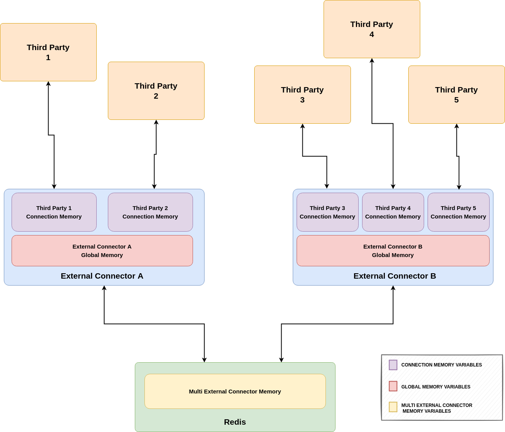

.. index:: Session Support & Memory Variables

.. _session_support_and_memory_variables:

Session Support & Memory Variables 
==================================

.. index:: Session Support

Session Support
---------------
We have already seen that the connection socket can be closed during the interaction. Either to be renew for the **external connector**, or
the third party, depending on the scenario (client or server mode). This introduces a challenge that is the capability of recognising the 
interaction session once the socket is renewed, and not considering it as a new interaction.

So as to do that, *Lope* has some mechanisms to have session support. In the ``operation`` section, there si a subsection not explained so far that is
``session``. In server mode,  this adds a session ID for each connection once it is created, and used later on to recognise the connection / interaction session.
This is done via checking this ID for each request before executing any rule. The session information is expected to have a key-value structure, where the symbol 
to separate the key and the value can be configured, as well as what is the ending character of the session information (it can be empty).

Therefore, if the structure is something like this ``KEY+KEY_VALUE_SEPARATOR+{session_value}+END_VALUE`` 

In this example ``jsession:srfksdhbq234r;`` we can identify the different parts of the structure:
    * ``KEY`` = ``jsession``
    * ``KEY_VALUE_SEPARATOR`` = ``:``
    * ``session_value`` = ``srfksdhbq234r``
    * ``END_VALUE`` = ``;``

In server mode, the ``session_value`` can be In client mode, identifying the session can autogenerated using different options. You can add the session key (``KEY``) and 
the session value (``session_value``) by using the reserved words ``{{SESSION_KEY}}`` and ``{{SESSION_VALUE}}`` in the ``response`` or ``value`` field in any rule (curvy brackets included).
The following is how the session support configuration can be configured:

.. code-block:: 

  # -----------------------------------------------------------
  # Operational parameters of the interation 
  # and connection with third parties
  # -----------------------------------------------------------
  operation:

      # GENERAL ASPECTS
      # ===============
      ...

      # TO ENABLE TLS/DTLS USE
      # ======================
      ...

      # SOCKET CONNECTION CLOSE
      # =======================
      ...

      # SESSION SUPPORT
      # ===============
      session:
          # To use or not the session support 
          enable: no # yes/no(default)

          # session key
          key: id

          key_value_separator: ":"

          # character after the session value (if not present, 
          # it will try to limit the session value via a 'space' 
          # character, 'brake line' character, or 'end' character)
          end_value: "," 

          #  for server mode
          autogenerated: 

              enable: yes # yes(default)/no

              number_characters: 20 # default 12

              # One of the following: "numbers", "hex_lower", "hex_upper", 
              # "hex_mix", "alphanumeric_upper", "alphanumeric_lower"(default), 
              # "alphanumeric_mix", "alphanumeric_and_symbols_upper", 
              # "alphanumeric_and_symbols_lower", "alphanumeric_and_symbols_mix"
              characters_type: alphanumeric_lower
          
          # Session ID can be updated via conversation rules
          update:

              # is it possible to change the session ID during the interaction?
              enable: yes # yes/no(default)

              # One of the following: 
              # "rule_detected", "rule_executed(default)"
              when: rule_executed 

      # OTHER TOPICS
      # ============
      # Additional aspects should be defined here, but 
      # they will be described in the respective sections
      # of this documentation, for the sake of clarity
      ...

As you can see, the session values can be changed via custom rules. This can be at the time of 'rule detection' 
(when the rule is analysed as applicable), or after its execution ('rule execution'). This can be done by adding the following fields:

.. code-block:: 

  any_custom_rule:

      # GENERAL FIELDS
      # ==============
      ...

      # SESSION UPDATE FIELDS
      # =====================
      # If several rules are applicable, they are overwritten. 
      # The last one is the one that remains 
      # (usually, the one with the larger ID)
      session_update:
          # allow that this rule can do the session update
          enable: yes # yes/no (default)

          # Several options available. In case several of them, 
          # the preference orderis the following:  
          #1-memory variable, 2-autogenerated value, 3-fixed value

          # OPTIONS:

          # 1 - Using memory variable, the content of the 
          #  memory variable (they are explained below in this chapter)
          memory_variable: var1 

          # OR

          # 2 - Create a new session ID using the configuration
          # of the 'operation' section
          # only used when 'memory_variable' is empty or not used
          autogenerated_value: yes # yes/no (default)

          # OR

          # 3 - Fixed value (hardcoded value) 
          # only used when 'memory_variable' is empty or not used, 
          # and 'autogenerated_value' is 'no' or not used
          fixed_value: [any value you wish]

      # OTHER FIELDS
      # ============
      # Other fields expalined in this documentation
      ...

.. index:: Memory Variables Declaration

Memory Variables
----------------

We have already seen the session support, and this could be considered as an example
of a memory variables (``SESSION_KEY`` and ``SESSION_VALUE``). These variables ar the way to save some data and have 
'memory' about the interaction. The variables must be declared in the *conversation rules* file and they are typed, 
so they shuold be used always in the same way (if it is an ``int``, then do not use it as a ``string``). 

There are different scopes for this variables:
  * **Connection (Interaction) Level**: These variables 'live' in the context of a connection or interaction, they 
    are only accesible and usable in the context of a specific connection with a third party. Every time a new connection
    is established, a new set of the these memory varibales are provided for that connection or interaction.

  * **Global Level**: The variables of this memory level are shared among different connections within one **external connector**,
    and they are created at the beginning of the execution. They are accesible and usable for any connection that happens with the 
    third parties that are interacting with that **external connector**. 

  * **Multi External Connector Level**: These variables are located in the redis server, and they are shared among all the 
    **external connectors**. This kind of memory is the 'execution' memory level of *Lope* and it is created for the first
    **external conenctor** that is executed. 

The use of multi external connector memory variables is not enable by default, and you can do it using by 'enabling' the field
``memory_variables_multi_ext_connector_enable`` in the ``operation`` section. Just remember that you also have to configure the connection
between the **external connection** and the Redis server, as explaind in :ref:`external_connector_configuration`.

Additionally, since several **external connectors**  may try to initialize the same memory variable in the same execution, we need to put 
some control there. This can be carried out using the field ``multi_ext_connector_memory_overwrite_during_init`` under the ``operation`` section. 
This allows us to mark if a new **external connector** should overwrite the exisisting variable in Redis at the initialization phase, or not. 
By default, any new execution checks if the memory variable already exists in Redis, and if not, the **external connector** creates it. If it exist, 
it depends on the value of that field in ``operation`` to overwrite it or not.

The following diagram represents the different kind of memories that can contain the memory variables, according to their scope:

.. index:: Memory Variable Declaration

They can be used in any response for any rule, by puting the variable name under double curvy brackets: ``{{variable_name}}``, 
and used in many different operations as explained in this page. However, they should be defined previously before being used.
In the definition, they can be initialized as well, and the initialization can be either using a fixed value or autogenerated value.

You can define memory variables within the memory variables. At the time of using it to send a response to the third party, the first memory
variable will be added, and later on, the second. This feature allows that memory variables can work as 'templates for replying' as well. 
Since this functionality is replacing memory variables until there is none, you can create as many template levels as you wish.

In case of several memory variable names have the same name, the one with the reduced scope is the one used at the time of being used.
Therefore, the preference order is: connection level > global level > milti external connector level. The declaration of the memory variables 
is done in the ``memory`` section (same level than ``operation``). The supported types are ``int``, ``float``, ``string``, ``bool``; 
where the ``string`` one is the default one used if the type is not declared. The following example shows how the declaration of memory variables
is done using fixed values.

.. code-block:: 

  # -----------------------------------------------------------
  # Operational parameters of the interation 
  # and connection with third parties
  # -----------------------------------------------------------
  operation:

      # GENERAL ASPECTS
      # ===============
      ...

      # TO ENABLE TLS/DTLS USE
      # ======================
      ...

      # SOCKET CONNECTION CLOSE
      # =======================
      ...

      # SESSION SUPPORT
      # ===============
      ...

      # MEMORY VARIABLES
      # ================
      # To enable the use of Redis server to share memory 
      # variables between external connectors
      memory_variables_multi_ext_connector_enable: yes # yes/no(default) 

      # To overwrite exisisting memory variables in Redis 
      # during the initialization phase
      multi_ext_connector_memory_overwrite_during_init: yes # yes/no(default) 

      # OTHER TOPICS
      # ============
      # Additional aspects should be defined here, but 
      # they will be described in the respective sections
      # of this documentation, for the sake of clarity
      ...

  # -----------------------------------------------------------
  # Execution memory
  # -----------------------------------------------------------
  # list of memory variables to be used in the simulation
  memory_variables:

    multi_extconn_level: 
      - name: var1
        default_value: 0
        type: int

      - name: var2
        default_value: False
        type: bool

    global_level: 
      - name: var3
        default_value: 2.71
        type: float

      - name: var4
        default_value: False
        type: bool

    connection_level: 
    - name: var5
      default_value: 14qwefa234rt
      type: string

    - name: var6
      default_value: I am a string :)

And this another example shows how to define memory variables using autogenerated values at the connection level,
but it works in the same way for any other memory level:

.. code-block:: 

  # -----------------------------------------------------------
  # Operational parameters of the interation 
  # and connection with third parties
  # -----------------------------------------------------------
  operation:

      # GENERAL ASPECTS
      # ===============
      ...

      # TO ENABLE TLS/DTLS USE
      # ======================
      ...

      # SOCKET CONNECTION CLOSE
      # =======================
      ...

      # SESSION SUPPORT
      # ===============
      ...

      # MEMORY VARIABLES
      # ================
      # To enable the use of Redis server to share memory 
      # variables between external connectors
      memory_variables_multi_ext_connector_enable: yes # yes/no(default) 

      # To overwrite exisisting memory variables in Redis
      # during the initialization phase
      multi_ext_connector_memory_overwrite_during_init: yes # yes/no(default)

      # OTHER TOPICS
      # ============
      # Additional aspects should be defined here, but 
      # they will be described in the respective sections
      # of this documentation, for the sake of clarity
      ...

  # -----------------------------------------------------------
  # Execution memory
  # -----------------------------------------------------------
  # list of memory variables to be used in the simulation
  memory_variables:

    connection_level: 

      # String autogenerated memory variable
      - name: random_string__token
        type: string

        autogenerated: 
          enable: yes # yes/no(default)

          number_characters: 6 # default 12

          # One of the following: "numbers", "hex_lower",
          # "hex_upper", "hex_mix", "alphanumeric_upper", 
          # "alphanumeric_lower"(default), "alphanumeric_mix",
          # "alphanumeric_and_symbols_upper", 
          # "alphanumeric_and_symbols_lower", 
          # "alphanumeric_and_symbols_mix"
          characters_type: alphanumeric_mix

      # Float autogenerated memory variable
      - name: random_float
        type: float

        autogenerated: 
          enable: yes # yes/no(default)

          min_limit_interval: 0
          max_limit_interval: 1

      # Int autogenerated memory variable
      - name: random_int
        type: int

        autogenerated: 
          enable: yes # yes/no(default)

          min_limit_interval: 0
          max_limit_interval: 100

      # Bool autogenerated memory variable
      - name: random_bool
        type: bool

        autogenerated: 
          enable: yes # yes/no(default)

If no value is provided in the definition, then the default values are:
  * '0' for ``float`` and ``int`` types 
  * 'false' for ``boolean`` types
  * an empty string for ``string`` types

